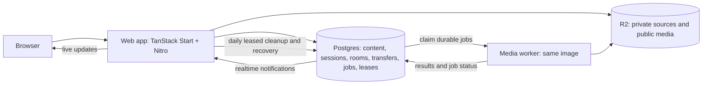

# milk & henny

A portable TanStack Start application for writing, photo galleries, party games, private file
transfers, and events/ticketing.

The web application is a standard Node server. The included Docker image runs on Railway, a VPS,
or another container host.

## Runtime architecture



Postgres owns durable state and work; R2 owns files. The web process runs user-visible schedules
with Postgres leases, including daily cleanup and recovery. The media worker drains heavy jobs.
Production no longer connects to Redis. See
[architecture](./docs/architecture.md) and [durable work](./docs/durable-work.md) for the contracts.

The application is a modular monolith. UI routes collect intent, server functions and API routes
enforce transport/auth boundaries, feature modules own workflows, and `lib/platform` contains
external adapters.

## Requirements

- The Node.js version used by the Dockerfile
- The package-manager version pinned by `packageManager` in `package.json`
- PostgreSQL for application state and durable work
- S3-compatible object-storage credentials for media and transfers

## Local development

```bash
cp .env.example .env.local
pnpm install --frozen-lockfile
pnpm dev
```

Open `http://localhost:3000`.

Fill in the database, object-storage, and authentication values in `.env.local`. Select the
Postgres stores listed in the template for a Redis-free local run.

Useful commands:

```bash
pnpm check
pnpm test
pnpm build
pnpm start
pnpm cli
```

The project uses the native TypeScript compiler (`tsgo`), Oxlint, and Oxfmt. ESLint and Prettier are
intentionally not part of the toolchain.

## Environment contract

Copy [`.env.example`](./.env.example). A full production deployment needs these core values. The
template also documents the Postgres store selectors, worker role, and optional integrations:

```dotenv
VITE_BASE_URL=https://milkandhenny.com
VITE_MEDIA_PUBLIC_URL=https://pics.milkandhenny.com

DATABASE_URL=

R2_ACCOUNT_ID=
R2_PUBLIC_BUCKET=milkandhenny-pics
R2_PUBLIC_ACCESS_KEY=
R2_PUBLIC_SECRET_KEY=
R2_PRIVATE_BUCKET=milkandhenny-private
R2_PRIVATE_ACCESS_KEY=
R2_PRIVATE_SECRET_KEY=

AUTH_SECRET=
ADMIN_PASSWORD=
UPLOAD_PIN=
```

Only `VITE_*` variables enter the browser bundle. Never prefix credentials or authentication secrets with `VITE_`.

`CRON_SECRET`, media-worker configuration, external ZIP service settings, and performance tuning
are documented in `.env.example`. Production sets the application store selectors to `postgres`
and runs migrations before starting restricted web and worker database roles; see
[deployment](./docs/deployment.md) and [Postgres runtime roles](./docs/postgres-runtime-roles.md).

Effect v4 owns backend orchestration and lifecycle for Events, Media, Multiplayer, and Pitches.
Product rules, repositories, and browser code remain ordinary TypeScript. Postgres stores
authoritative room state and the leased media queue, and carries cross-replica wake notifications.

Application-owned runtime metadata uses `APP_COMMIT_SHA` and `APP_INSTANCE_ID`. Hosting-provider metadata is accepted only as an adapter when those canonical variables are omitted; an instance ID must be unique per running process or replica.

## Health and capabilities

- `/api/health` — machine-readable readiness check with bounded required-capability probes.
- `/health` — safe human-readable capability page.
- `/api/debug` — admin-protected deep database, object-storage, and runtime probes.

The capability page distinguishes required services from optional functions. Advanced RAW/video processing is expected to show as disabled while `MEDIA_PROCESSOR_MODE=local`.

## Docker or VPS

Build-time public values must be supplied while creating the image:

```bash
docker build \
  --build-arg VITE_BASE_URL=https://milkandhenny.com \
  --build-arg VITE_MEDIA_PUBLIC_URL=https://pics.milkandhenny.com \
  -t milkandhenny .
```

Run with the remaining variables supplied through an env file or secret manager:

```bash
docker run --env-file .env.local -p 3000:3000 milkandhenny
```

The image runs as an unprivileged user, listens on `$PORT`, and includes a Docker health check.

## Railway

`railway.toml` selects the same Dockerfile and `/api/health` endpoint used everywhere else. Railway is deployment configuration only; application code does not import Railway APIs.

Deployment sequence:

1. Create a Railway project and web service.
2. Add the production variables from `.env.example`.
3. Deploy the repository or current directory.
4. Verify the temporary Railway domain and `/health`.
5. Add the custom domains and update DNS.
6. Keep the previous deployment available briefly for rollback.

## Scheduled maintenance

The web process runs cleanup and recovery once a day under a Postgres lease. Each task is bounded;
one failure does not prevent later tasks, and the failed batch retries after an hour. Reminders,
email, event drops, digests, and game-pool cleanup have their own shorter leased schedules. See
[operations](./docs/operations.md) for the jobs, limits, and manual recovery routes.

## Media worker

Images and GIFs are processed inline. RAW previews and video posters are queued in Postgres for a
dedicated worker—the same server image run with `MEDIA_WORKER_ROLE=worker`.

```dotenv
MEDIA_PROCESSOR_MODE=local    # everything inline; the default for development
MEDIA_PROCESSOR_MODE=hybrid   # heavy routes queued; requires a worker with Postgres job storage
```

See [`docs/media-worker.md`](./docs/media-worker.md) for the split, the delivery
guarantees, and the cutover order.

## Documentation

See [`docs/README.md`](./docs/README.md) for architecture, security, media, operations, and deployment notes.
